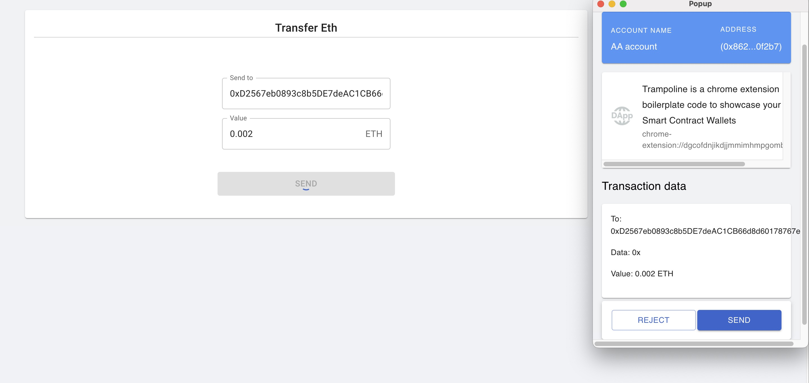

# ETHTaipei2024 - Paymaster

Implementation of reducing transaction gas based on trampoline and AAStar-paymaster.

## Get the browser extension wallet

1. Clone this repository.
2. Move into `AAStar-Basic-Wallet` folder 
3. Run `yarn install` to install the dependencies.
4. Run `yarn start`
5. Load your extension in Chrome by following these steps:
   1. Go to `chrome://extensions/`
   2. Enable `Developer mode`
   3. Click on `Load unpacked extension`
   4. Select the `build` folder.

## Create an account

1. Set name

2. Click to continue

## Deploy account

1. Add a little gas fee to the new account so that it can be deployed

Then

Click the button `Deploy Account`

Add paymasterAndData (it's `0xAEbF4C90b571e7D5cb949790C9b8Dc0280298b63` which is a paymaster address)

Next, click the button `Continue` and `Send`

After a while, we can see the picture below

The first gasless transaction has been completed.

## Send your second gasless transaction

Click `SEND` button, we can get this.

Enter address and value.
Like this, then send transaction.

Add paymasterAndData, then click `Continue`

Confirm the transaction, then click the `SEND`

After a while, we can see the picture below

If you want to see detailed information, you can go to [Etherscan](https://sepolia.etherscan.io/address/0x862d7238f81334D81930C6945425062b47a0f2b7#internaltx) to view it.

